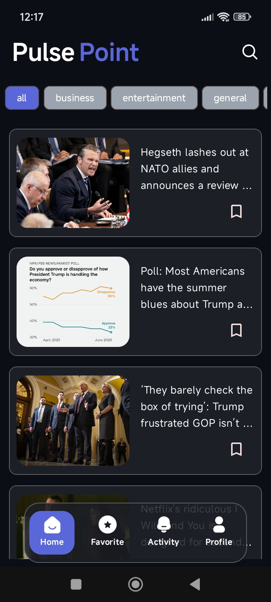
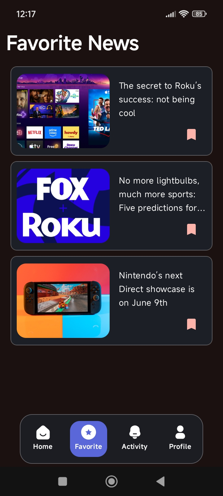
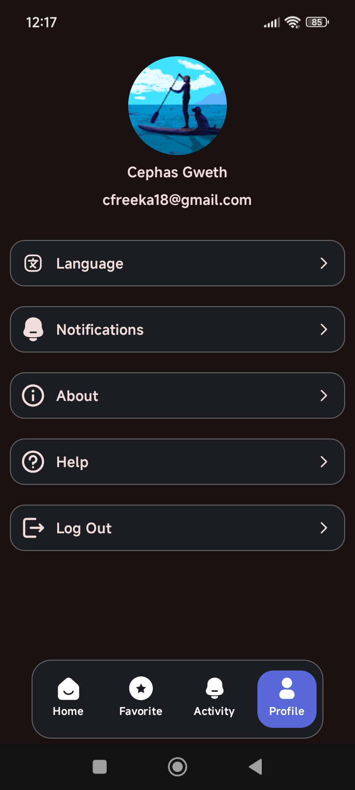

# Pulse Point 📰

Pulse Point is a sleek, modern Android news application designed to keep you updated on the latest headlines across business, entertainment, general news, and more. Built with **Clean Architecture** and **Jetpack Compose**, it delivers a fluid, responsive user experience from browsing to organizing your favorite stories.

## 📱 App Screenshots

  
  
  
  

---

## ✨ Features

*   **Dynamic News Feed:** Stay ahead with real-time news across multiple categories like Business, Entertainment, Health, Science, Sports, and Technology.
*   **Offline Reading (Bookmarks):** Save your favorite articles locally using Room database to read them anytime, even without an internet connection.
*   **Smart Search:** Quickly find specific articles or topics using the integrated search functionality powered by Paging 3 for smooth scrolling.
*   **Secure Authentication:** Seamless sign-in experience using Firebase Authentication and the latest Google Credential Manager.
*   **User Profiles:** Manage your account and app preferences through a clean, intuitive dashboard.
*   **Clean & Modern UI:** A fully declarative UI built with Jetpack Compose, following Material 3 design guidelines.

## 🛠️ Tech Stack & Architecture

*   **Language:** [Kotlin](https://kotlinlang.org/)
*   **UI Framework:** [Jetpack Compose](https://developer.android.com/jetpack/compose)
*   **Architecture:** Multi-module Clean Architecture (Domain, Data, UI separation)
*   **Dependency Injection:** [Koin](https://insert-koin.io/)
*   **Networking:** [Retrofit](https://square.github.io/retrofit/) & [Gson](https://github.com/google/gson)
*   **Local Database:** [Room](https://developer.android.com/training/data-storage/room)
*   **Image Loading:** [Coil](https://coil-kt.github.io/coil/)
*   **Asynchronous Programming:** [Kotlin Coroutines](https://kotlinlang.org/docs/coroutines-overview.html) & [Flow](https://kotlinlang.org/docs/flow.html)
*   **Pagination:** [Paging 3](https://developer.android.com/topic/libraries/architecture/paging/v3-paged-data)
*   **Authentication:** [Firebase Auth](https://firebase.google.com/docs/auth) & [Credential Manager](https://developer.android.com/training/sign-in/credential-manager)

---

## 🏗️ Project Structure

The project follows a multi-module architecture to promote scalability and separation of concerns:

-   `:app`: The entry point of the application, responsible for DI initialization and navigation.
-   `:features`: Contains all the feature-specific UI and ViewModels (Home, Search, Favorites, Auth, Profile).
-   `:core`: Shared logic, networking, database, domain models, and repository implementations.

---
